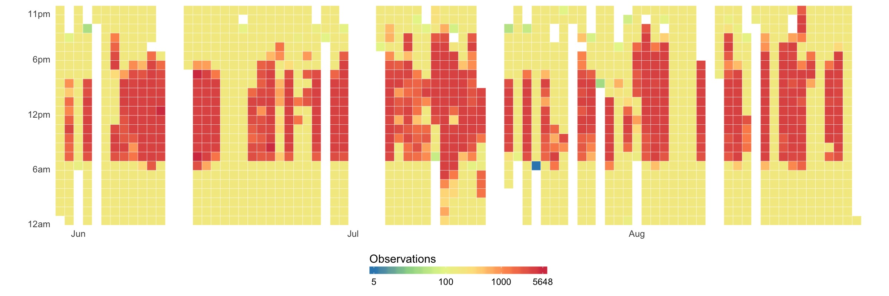
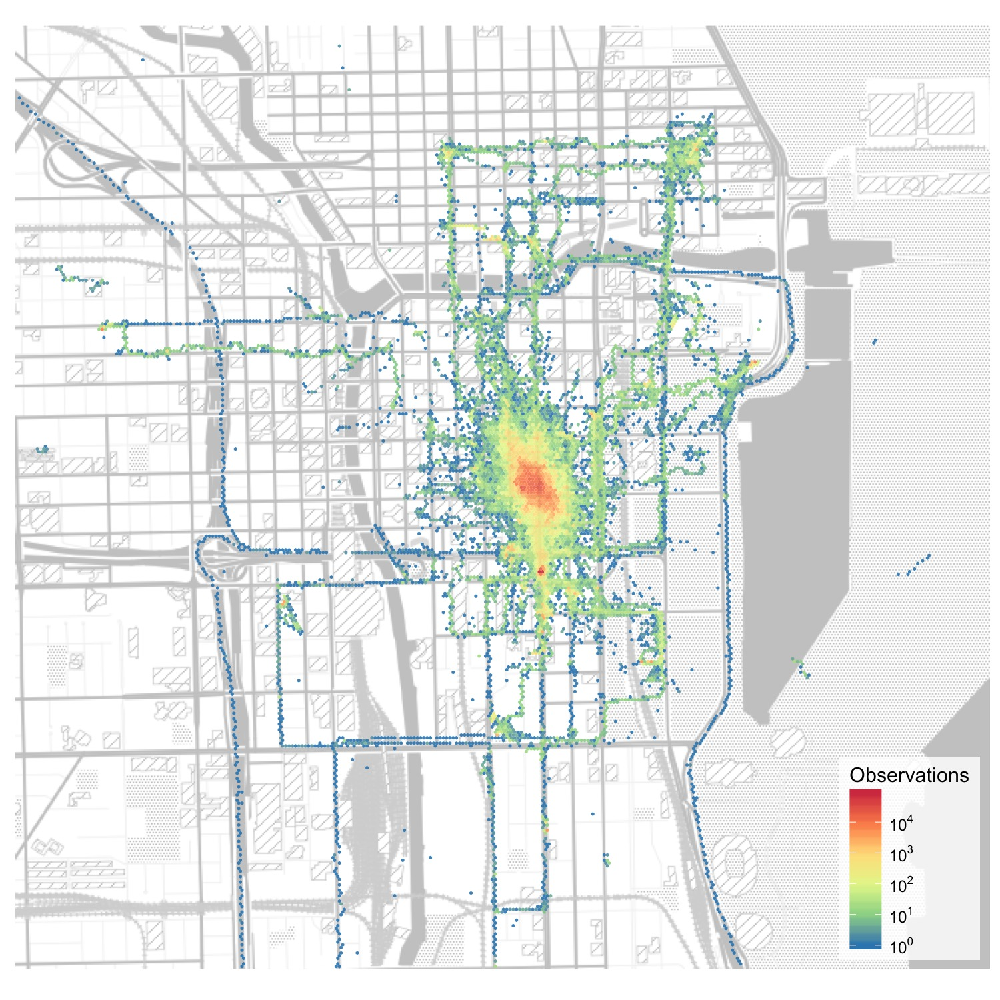

# Introduction

## About the data release

The [Beiwe Research Platform](https://www.hsph.harvard.edu/onnela-lab/beiwe-research-platform/) collects high-density data from a variety of smartphone sensors including GPS, WiFi, Bluetooth, and accelerometer. To learn more about Beiwe, check out the [Onnela Lab](https://www.hsph.harvard.edu/onnela-lab/beiwe-research-platform/) page, the [paper introducing the platform](https://mental.jmir.org/2016/2/e16/), or the [Beiwe wiki](http://wiki.beiwe.org/).

In order to help current and potential collaborators understand the structure and format of Beiwe data, we are making our personal data available to the public. The hope is that access to real data will allow researchers to (1) facilitate coding and debugging for ETL, data ingestion, and other parts of their pipeline before data is collected, (2) create functions to help inspect raw data, and (3) test new methods or functions on real data.

## Getting the data 

Due to size limitations, this repository does not contain the data. To get the data, please [download it from Zenodo](https://zenodo.org/record/1188879). This repository contains information about the data, and we will add example notebooks of manipulating the data here. The original, raw release will always remain the same at the [Zenodo](https://zenodo.org/record/1188879) page.

## Citations

The Digital Object Identifier of this dataset is [`10.5281/zenodo.1188879`](https://zenodo.org/record/1188879). When using these data, please cite the dataset as 

> Kiang, Mathew, Lorme, Jeanette, & Onnela, Jukka-Pekka. (2018). Public Sample Beiwe Dataset (Version 0.1) [Data set]. Zenodo. http://doi.org/10.5281/zenodo.1188879

When referring to the Beiwe Research Platform or how these data were collected, please cite the [JMIR-Mental Health paper](https://mental.jmir.org/2016/2/e16/) as:

> Torous J, Kiang MV, Lorme J, Onnela JP, New Tools for New Research in Psychiatry: A Scalable and Customizable Platform to Empower Data Driven Smartphone Research, JMIR Ment Health 2016;3(2):e16. URL: https://mental.jmir.org/2016/2/e16, DOI: 10.2196/mental.5165

## License

This work (both code and data) is licensed under a [Creative Commons Attribution Share-Alike 4.0 License (CC-BY-SA-4.0)](https://creativecommons.org/licenses/by-sa/4.0/legalcode). 

## Funding
Development of the Beiwe Research Platform and data analysis pipeline was enabled by National Institute of Health Director’s New Innovator Award to Dr. [JP Onnela](https://www.hsph.harvard.edu/onnela-lab/) (DP2MH103909).

# About the data

The original data come from 3 people using 5 different study settings of various durations and starting/ending dates. 

## Anonymization
In [the public release dataset](https://zenodo.org/record/1188879), all audio files have been removed (but users that collected audio files will still have an `audio_recordings` folder). Further, some GPS data have been anonymized by creating a bounding box around sensitive areas. Any observation within the bounding polygon is replaced anonymized by using last observation carried forward and adding a small amount of Gaussian noise.

## Study settings

Researchers may specify different data collection parameters for every study. The Beiwe app collects accelerometer, Bluetooth, call, GPS, gyroscope, magnetometer, power state, proximity, text, and WiFi data whenever possible or specified. Not all sensors are available on all phones. Call, power state, and text data were collected when events occurred, which, in these test data, was relatively infrequently. See the [official Beiwe documentation](http://wiki.beiwe.org/) for more details. 

This table shows the study settings for each of the public-use studies. All durations are in seconds. The sensors are accelerometer ("Accel."), GPS, gyroscope ("Gyro."), magnetometer ("Mag."), DeviceMotion ("DM"; iOS devices only), Bluetooth ("BT"), and WiFi. Bluetooth is parameterized as amount of time spent on (logging nearby Bluetooth devices) out of a total amount of time. WiFi is parameterized as the frequency at which WiFi networks should be logged. All other sensors are parameterized as amount of time on and off.

| Study ID                     | Users  (n) | First file  timestamp | Last file  timestamp | Accel.  (on/off) | GPS  (on/off) | Gyro.  (on/off) | Mag.  (on/off) | DM  (on/off) | BT  (on/total) | WiFi  (log freq) |
|------------------------------|-----------|----------------------|---------------------|-----------------|--------------|---------------|--------------|-------------|---------------|-----------------|
| `onnela_lab_gps_testing`     | 1         | `2016-01-26 19_00_00` | `2016-02-04 14_00_00` | 10/10           | 7140/60      | 60/600        | 60/600       | 60/600      | 60/300        | 300             |
| `onnela_lab_ios_test1`       | 1         | `2016-06-03 19_00_00` | `2016-06-04 16_00_00` | 10/900          | 60/1200      | 60/1200       | 60/600       | 60/600      | 60/300        | 300             |
| `onnela_lab_ios_test2`       | 2         | `2016-06-07 18_00_00` | `2016-06-08 00_00_00` | 10/10           | 60/600       | 60/600        | 60/600       | 60/600      | 60/300        | 300             |
| `onnela_lab_test1`           | 1         | `2016-10-17 19_00_00` | `2017-02-13 13_00_00` | 10/1250         | 60/1200      | 60/1200       | 60/1200      | 60/1200     | 60/300        | 300             |
| `passive_data_high_sampling` | 1         | `2016-05-30 08_00_00` | `2016-08-25 07_00_00` | 600/60          | 7140/60      | 60/600        | 60/600       | 60/600      | 60/300        | 10              |

# Sample plots

```{r fig.height=5}
## Code can be found in "./code/plotting_hourly_heatmap_study1.R"

```

Similarly, we can aggregate over time and show heatmap of all GPS points on a map of Chicago.

```{r fig.height=5, fig.width=5}
## Code can be found in "./code/plotting_chicago_data.R"

```


